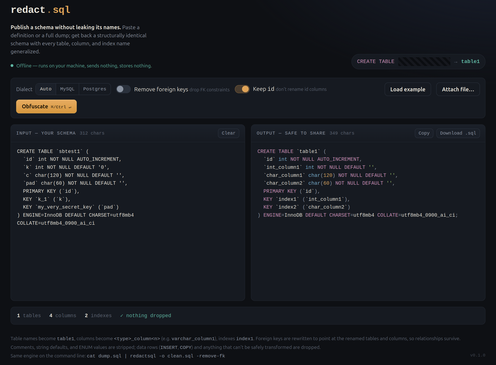

# redact.sql

**Publish a SQL schema without leaking its names.**

Paste a `CREATE TABLE` dump (MySQL or PostgreSQL); get back a structurally identical schema with every table, column, index, constraint, sequence, type, and schema name replaced by neutral placeholders. Foreign-key relationships are rewritten to match, so the topology survives intact.

```
my_secret_table  →  table1
customer_email   →  varchar_column2
fk_buyer         →  fk1
```

Everything runs **locally and in memory**. Nothing is sent or stored anywhere.

---

<table>
  <tr>
    <td></td>
  </tr>
</table>

---
## Quick start

```sh
go build -o redactsql .
./redactsql          # opens http://127.0.0.1:8585
```

## CLI usage

```sh
# pipe from stdin
cat dump.sql | ./redactsql -o clean.sql

# read a file directly
./redactsql dump.sql -o clean.sql

# drop all foreign keys too
cat dump.sql | ./redactsql -remove-fk -o clean.sql

# force a dialect (auto-detected by default)
cat dump.sql | ./redactsql -dialect postgres -o clean.sql
```

## Flags

| Flag | Default | Description |
|------|---------|-------------|
| `-addr` | `127.0.0.1:8585` | Web server listen address |
| `-serve` | `false` | Force web server mode even when stdin is piped |
| `-o` | stdout | Write output to file |
| `-dialect` | `auto` | `auto` \| `mysql` \| `postgres` |
| `-remove-fk` | `false` | Drop all foreign key constraints |
| `-keep-id` | `true` | Keep columns literally named `id` unchanged |
| `-quiet` | `false` | Suppress the rename report on stderr |
| `-version` | — | Print version and exit |

## What gets transformed

| Input | Output |
|-------|--------|
| Table names | `table1`, `table2`, … |
| Column names | `varchar_column1`, `int_column2`, … |
| Index names | `index1`, `index2`, … |
| Constraint names | `pk1`, `fk1`, `uq1`, `chk1`, … |
| Sequence names | `seq1`, `seq2`, … |
| Custom type names | `type1`, `type2`, … |
| Schema names (non-standard) | `schema1`, `schema2`, … |
| String defaults & ENUM values | `''` / `'value1'` |
| `COMMENT` clauses | stripped |
| `INSERT`, `COPY`, data rows | dropped |

Well-known schemas (`public`, `pg_catalog`, `information_schema`, `mysql`, `sys`, `dbo`) are preserved as-is.

## Supported dialects

- **MySQL / MariaDB** — backtick quoting, `ENGINE=`, `AUTO_INCREMENT`, `CHARSET`, etc.
- **PostgreSQL** — `SERIAL`, sequences, `ALTER SEQUENCE … OWNED BY`, dollar-quoted strings, `COPY … FROM STDIN` blocks, `CREATE TYPE … AS ENUM`, `CREATE SCHEMA`

## Requirements

Go 1.21 or later. No external dependencies.

## License

MIT
